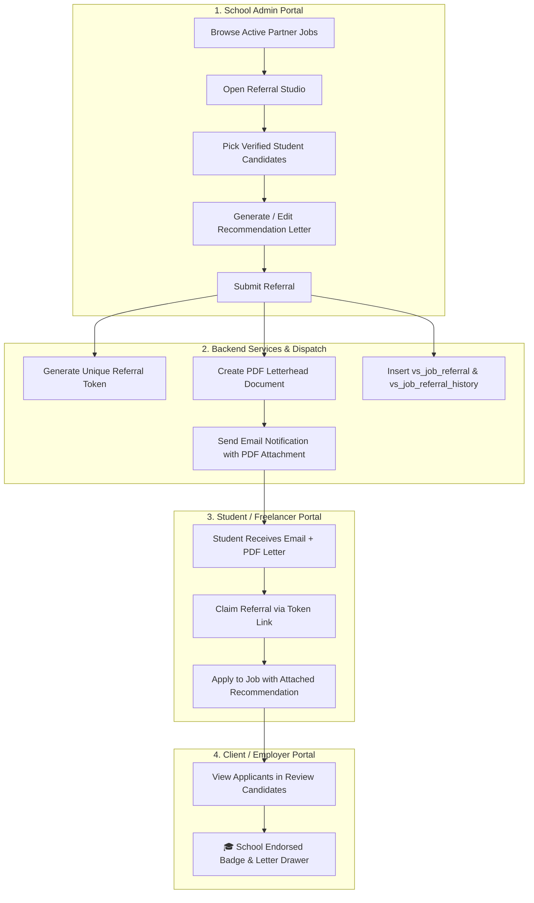

# School Admin Student Job Referral — Feature Walkthrough & Documentation

## 1. Overview & Architecture

The **School Admin Student Job Referral** system connects academic institutions with industry hiring partners on VOS Sync. It empowers School Administrators to proactively refer verified, registered students to active job openings, attach AI-assisted or custom recommendation letters, and deliver official institutional endorsement packages directly to students and employers.

---

## 2. Key Changes Summary by Component

### A. School Admin Referral Module
1. **Candidate Picker & Duplicate Prevention** ([`StudentCandidatePicker.tsx`](file:///c:/Private/Vertex/Projects/vos-sync/src/modules/school-admin/job-referrals/components/StudentCandidatePicker.tsx), [`job-referrals.repo.ts`](file:///c:/Private/Vertex/Projects/vos-sync/src/modules/school-admin/job-referrals/services/job-referrals.repo.ts), [`job-referrals.service.ts`](file:///c:/Private/Vertex/Projects/vos-sync/src/modules/school-admin/job-referrals/services/job-referrals.service.ts)):
   - Batch queries `vs_job_application` to check if students have already applied to the selected job.
   - Candidates who already applied display an **"Already Applied"** badge, have their selection checkbox disabled, and are excluded from "Select All" actions.
   - Fixed checkbox event bubbling (`e.stopPropagation()`) so clicking directly on the checkbox toggles selection properly.

2. **Recommendation Letter Studio & Modal Cleanup** ([`ReferralWizardModal.tsx`](file:///c:/Private/Vertex/Projects/vos-sync/src/modules/school-admin/job-referrals/components/ReferralWizardModal.tsx)):
   - Changed AI letter generation from automatic step transition to explicit user action via the **"Generate AI Letter"** button.
   - Removed duplicate top-right close `X` button (`showCloseButton={false}`).

3. **PDF Generation & Email Attachment** ([`job-referrals.helpers.ts`](file:///c:/Private/Vertex/Projects/vos-sync/src/modules/school-admin/job-referrals/services/job-referrals.helpers.ts), [`job-referrals.service.ts`](file:///c:/Private/Vertex/Projects/vos-sync/src/modules/school-admin/job-referrals/services/job-referrals.service.ts)):
   - Implemented `generateRecommendationPdfBuffer` using `jsPDF` to produce an official institutional letterhead PDF containing student info, position, formatted letter body, and signature block.
   - Automatically attaches `Recommendation_Letter_[Student_Name].pdf` to the student's notification email alongside the claim link.

---

### B. Student & Public Portal
1. **Referral Attribution & Claim Landing** ([`referral.service.ts`](file:///c:/Private/Vertex/Projects/vos-sync/src/modules/freelancer/freelancer-referrals/services/referral.service.ts), [`ReferralLandingClient.tsx`](file:///c:/Private/Vertex/Projects/vos-sync/src/app/(public)/referral/[token]/ReferralLandingClient.tsx)):
   - Accurately resolves the referring school name from `vs_school_admin` and displays official institutional branding.
2. **Infinite Reload Bugfix** ([`ApplyModal.tsx`](file:///c:/Private/Vertex/Projects/vos-sync/src/modules/job-browse/components/ApplyModal.tsx)):
   - Resolved re-render loop by stabilizing `referrerName` state dependencies.
3. **Instant "Already Applied" Synchronization** ([`useJobBrowse.ts`](file:///c:/Private/Vertex/Projects/vos-sync/src/modules/job-browse/hooks/useJobBrowse.ts), [`JobBrowseModule.tsx`](file:///c:/Private/Vertex/Projects/vos-sync/src/modules/job-browse/JobBrowseModule.tsx), [`JobDetailPage.tsx`](file:///c:/Private/Vertex/Projects/vos-sync/src/modules/job-browse/components/JobDetailPage.tsx)):
   - Added optimistic `markJobAsApplied(jobId)` updates on application submission, ensuring job cards and detail sheets update immediately from **"Apply Now"** to **"Already Applied"**.
4. **Applications Drawer** ([`route.ts`](file:///c:/Private/Vertex/Projects/vos-sync/src/app/api/freelancer/applications/route.ts), [`ApplicationTable.tsx`](file:///c:/Private/Vertex/Projects/vos-sync/src/modules/freelancer/freelancer-applications/components/ApplicationTable.tsx)):
   - Linked recommendation letter text into the student's applied job detail view.

---

### C. Client / Employer Portal
1. **Candidate Verification Badges & Endorsement Drawer** ([`ApplicantCard.tsx`](file:///c:/Private/Vertex/Projects/vos-sync/src/modules/client/applicants/components/ApplicantCard.tsx), [`ApplicantDetailsModal.tsx`](file:///c:/Private/Vertex/Projects/vos-sync/src/modules/client/applicants/components/ApplicantDetailsModal.tsx), [`route.ts`](file:///c:/Private/Vertex/Projects/vos-sync/src/app/api/client/applicants/route.ts)):
   - Displays a `🎓 School Endorsed` badge on referred applicants.
   - Provides a dedicated "School Recommendation" section with full letter text in the applicant details modal.
   - Fixed undefined reference bug in `/api/client/applicants`.

---

## 3. Step-by-Step Feature Walkthrough

### Step 1: School Admin Refers Candidates
1. Navigate to **School Admin > Job Referrals**.
2. Browse active partner job postings and click **"Refer Students"** on a target job.
3. In **Step 1 (Candidate Selection)**:
   - Filter students by name, skills, or course.
   - Candidates who have already applied are flagged with an **"Already Applied"** badge and cannot be selected.
   - Select one or more verified student candidates and click **"Next: Recommendation Studio"**.
4. In **Step 2 (Recommendation Studio)**:
   - Choose letter tone (e.g. *Academic Excellence*, *Leadership*, *Technical Skills*).
   - Click **"Generate AI Letter"** to draft a tailored letter, or write/edit custom text.
   - Click **"Send Referral & Letter"**.

### Step 2: Automated Notification & PDF Delivery
1. The system creates the referral record and generates a unique token.
2. An official PDF copy (`Recommendation_Letter_[Name].pdf`) is created with school letterhead and signature block.
3. An email is delivered to the student containing:
   - Referral details and partner company information.
   - The embedded recommendation text.
   - The attached `.pdf` document for their personal records.
   - A **"View Opportunity & Claim Referral"** link.

### Step 3: Student Claims & Applies
1. The student clicks the email link to open the **Referral Claim Page**.
2. The page displays the official endorsement from their university/school.
3. Clicking **"Claim Referral"** attaches the recommendation to their active session.
4. The student opens the job post, attaches their resume/cover file (or downloaded recommendation PDF), and submits.
5. The UI immediately updates the job status to **"Already Applied"**.

### Step 4: Employer Evaluates Endorsed Applicant
1. The hiring client opens **Review Candidates** in the Client Portal.
2. Endorsed candidates display the **"🎓 School Endorsed"** badge on their applicant card.
3. Clicking on the candidate opens their detail drawer, showcasing the full institutional recommendation letter alongside their resume and qualifications.
